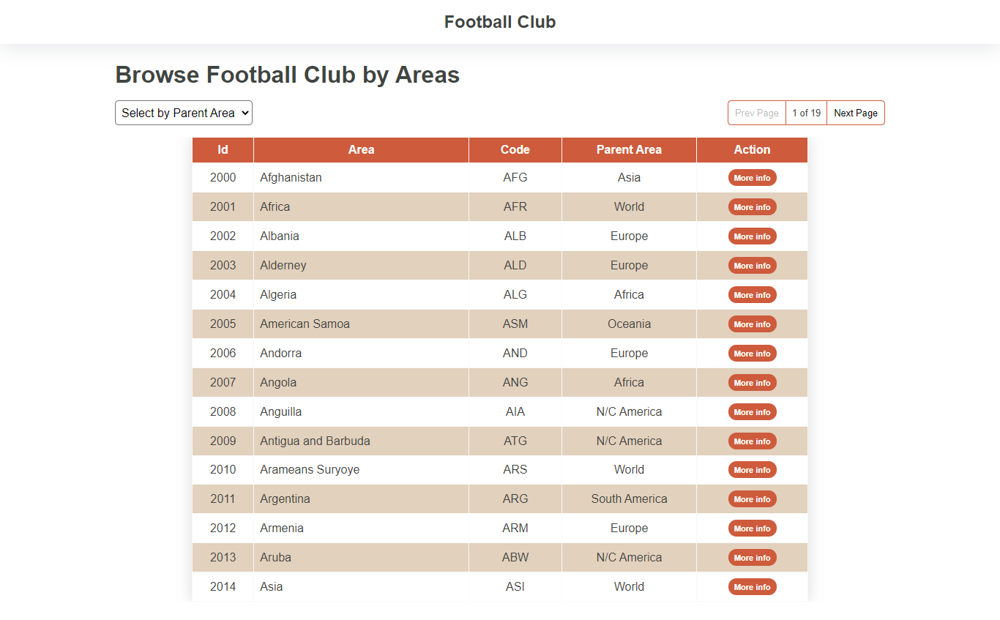
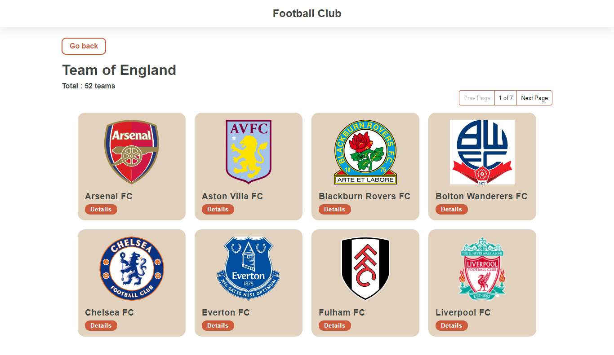
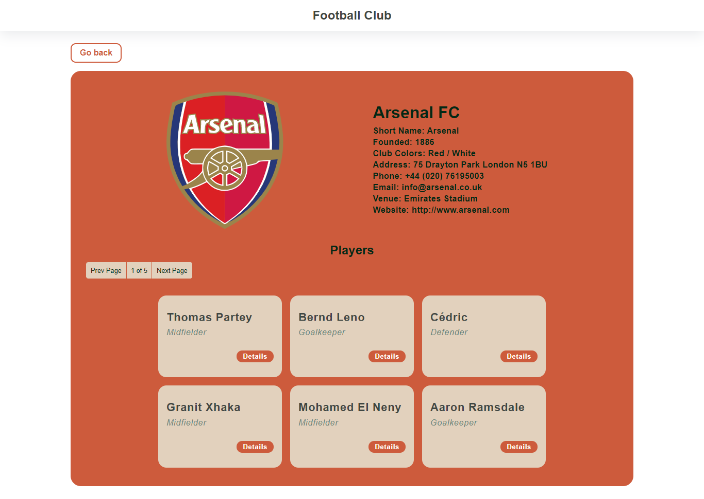

# Football-Club

Football Club merupakan sebuah website sederhana yang memberikan informasi tentang club sepak bola. Informasi yang ditampilkan mulai dari cakupan area, informasi club di spesifik area, profile club, dan profile pemain. Data didapatkan dari [football-data.org](https://www.football-data.org).

## Tech & Dependencies

- VueJS
- Vue Router
- Axios
- HTML
- CSS

## Link

Live site URL : [football-club](https://demo-football-club.vercel.app/)

### Screenshot





## Project setup

### Get Token API

- Signup to [football-data.org](https://www.football-data.org/client/register)
- Create .env file and add your token API

### Install Dependencies and Dev Dependencies

```
yarn install
```

### Compiles and hot-reloads for development

```
yarn serve
```

### Compiles and minifies for production

```
yarn build
```

### Run your unit tests

```
yarn test:unit
```

### Lints and fixes files

```
yarn lint
```

### Customize configuration

See [Configuration Reference](https://cli.vuejs.org/config/).
